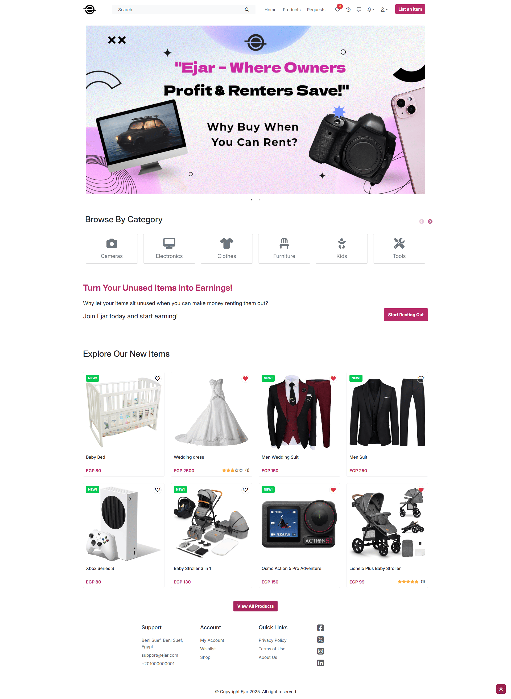
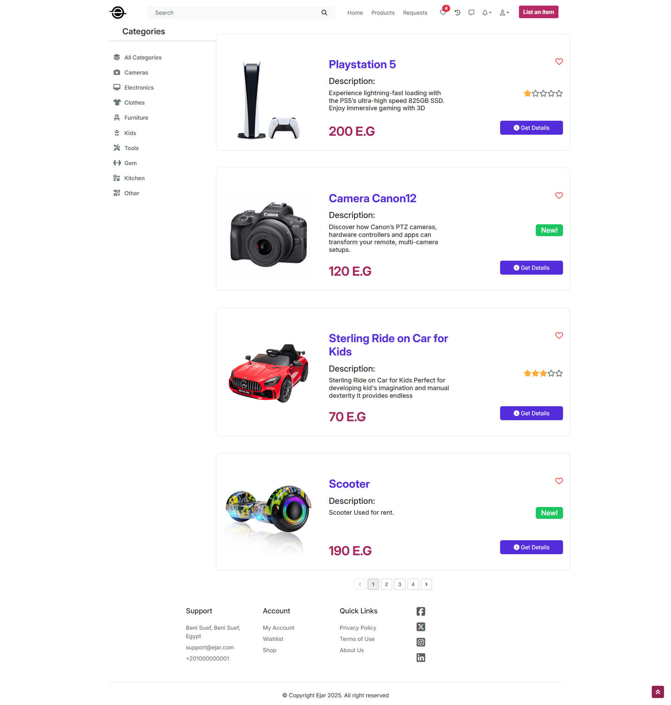
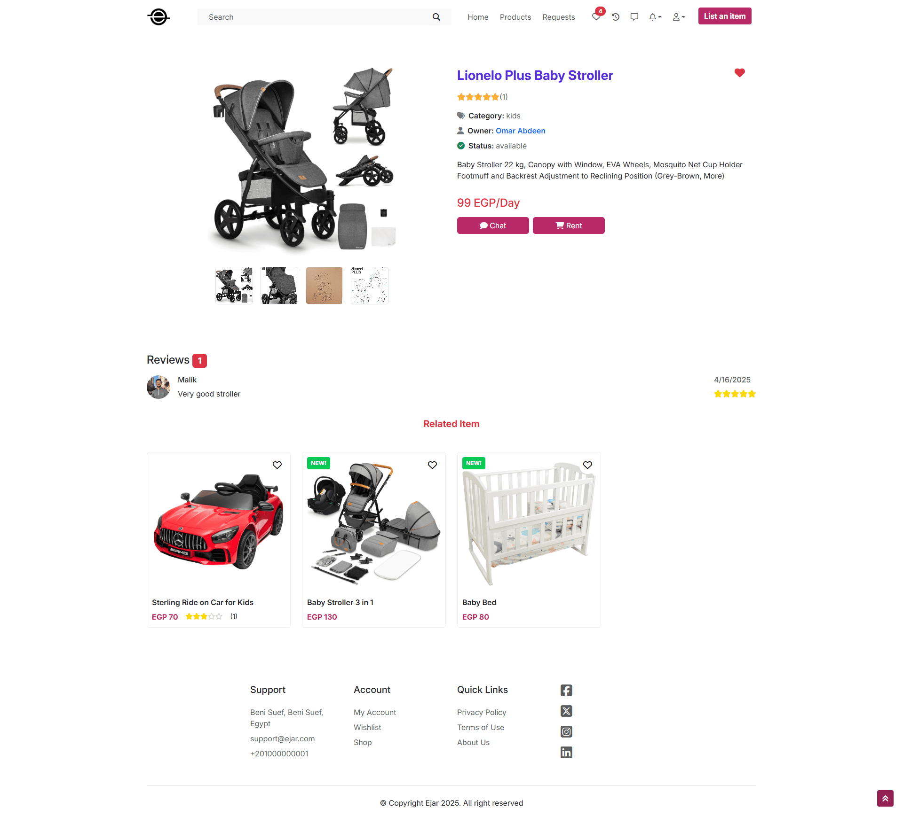
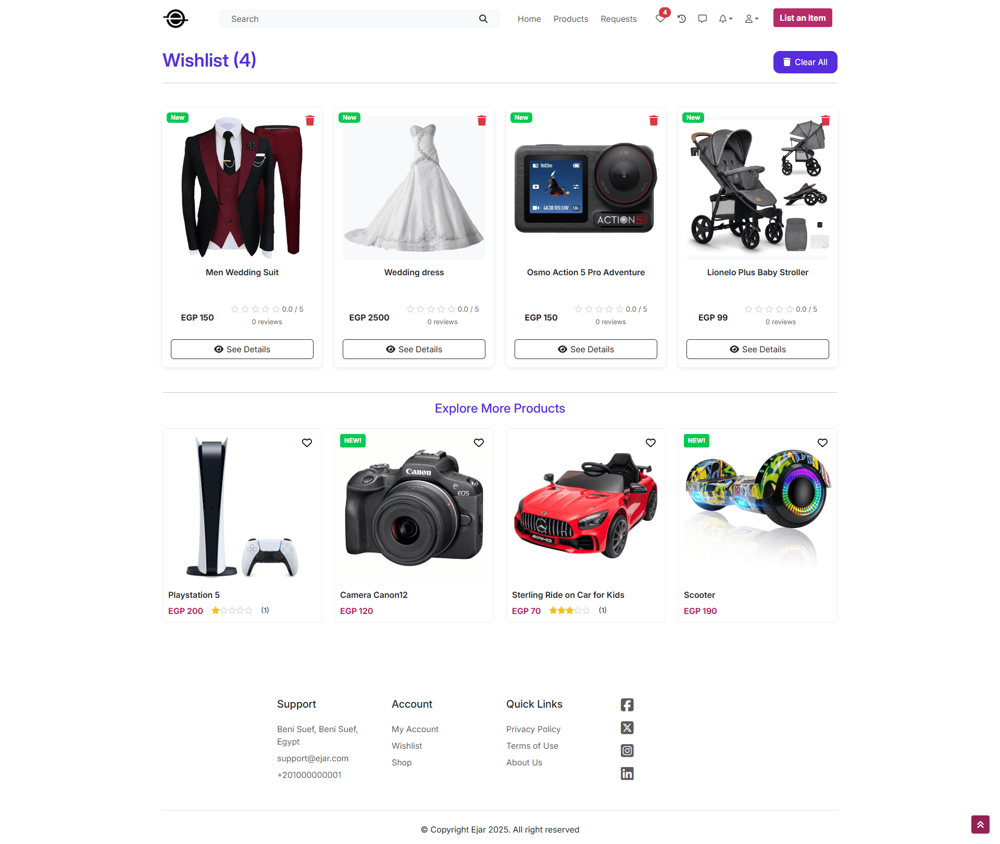
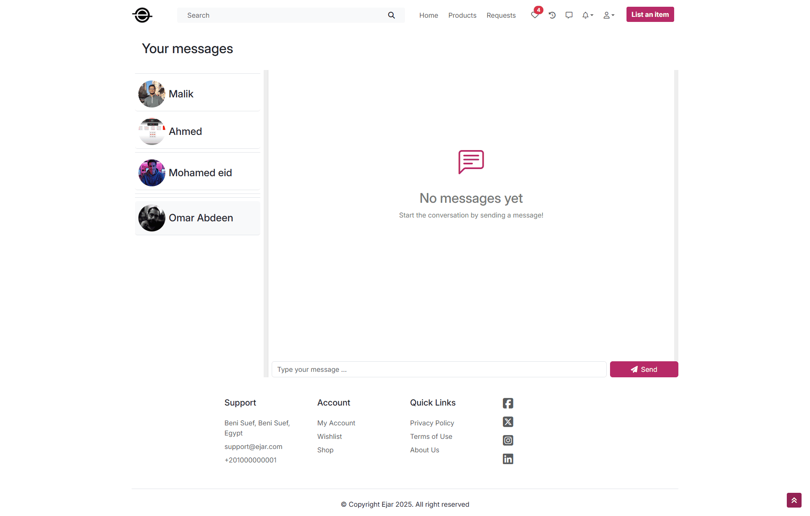

# 🏠 Ejar Rental Platform – (MEARN)

## 🎓 About the Project

This system was built as the final graduation project for the **ITI (Information Technology Institute) ICC Program**, designed to demonstrate full-stack web development skills using modern technologies and scalable architecture.

**Ejar** is a full-featured rental platform where users can rent out or borrow items from others.  
This system was developed as part of our **graduation project** for the **ITI ICC MEARN Track**, and it demonstrates real-world architecture by separating responsibilities across three dedicated apps:

---

## 📦 Project Modules

| App Name           | Description                                                  | GitHub Repository                                              |
|--------------------|--------------------------------------------------------------|----------------------------------------------------------------|
| **Customer Website** | React-based platform where users browse and rent items         | [Customer Frontend](https://github.com/MohamedAhIsmail/ejar-rental-platform-react) |
| **Admin Dashboard**  | Angular dashboard for managing users, listings, and stats      | [Admin Dashboard](https://github.com/MohamedAhIsmail/ejar-rental-dashboard-angular)          |
| **Backend API**      | Node.js + Express API serving both apps with auth, data & logic | [Backend API](https://github.com/MohamedAhIsmail/ejar-rental-platform-node)               |

---

## 📸 Screenshots

  
  
  
  
  

---

## ✨ Main Features

- 🧾 **User registration and authentication**
- 🛒 **Rent & lend items** via user-friendly interface
- 🔐 **Role-based access** (Admin / User)
- 🗂 **Product listing & management**
- ☁️ **File/image upload to Cloudinary**
- 💬 **Real-time chat with Socket.IO**
- 📈 **Dashboard analytics and reports**
- 📬 **Email notifications with Nodemailer**
- 📱 **Responsive UI across all devices**
- 🔍 **Search, filter, booking & calendar support**

---

## 🛠 Tech Stack

| Layer         | Technology                                                                  |
|---------------|-----------------------------------------------------------------------------|
| **Frontend**  | React 19, React Router v7, MUI, Zustand, Formik, Toastify, Slick Carousel   |
| **Dashboard** | Angular 19, Angular Material, Chart.js, D3, Bootstrap, ngx-toastr           |
| **Backend**   | Node.js, Express, MongoDB, Mongoose, JWT, Multer, Cloudinary, Socket.IO     |

---

## 👥 Team Members

| Name          | GitHub Profile                                         |
| ------------- | ------------------------------------------------------ |
| Mohamed Ahmed | [@MohamedAhIsmail](https://github.com/MohamedAhIsmail) |
| Malik Hussein | [@malikhussein](https://github.com/malikhussein)       |
| Ahmed Amr     | [@ahmedamr3000](https://github.com/ahmedamr3000)       |
| Mohamed Eid   | [@Mohamedeid602](https://github.com/Mohamedeid602)     |
| Omar Abdeen   | [@OmarAbdeen](https://github.com/Test0-VC)             |

---

## 📄 License

This project is open-source and available under the [MIT License](LICENSE).