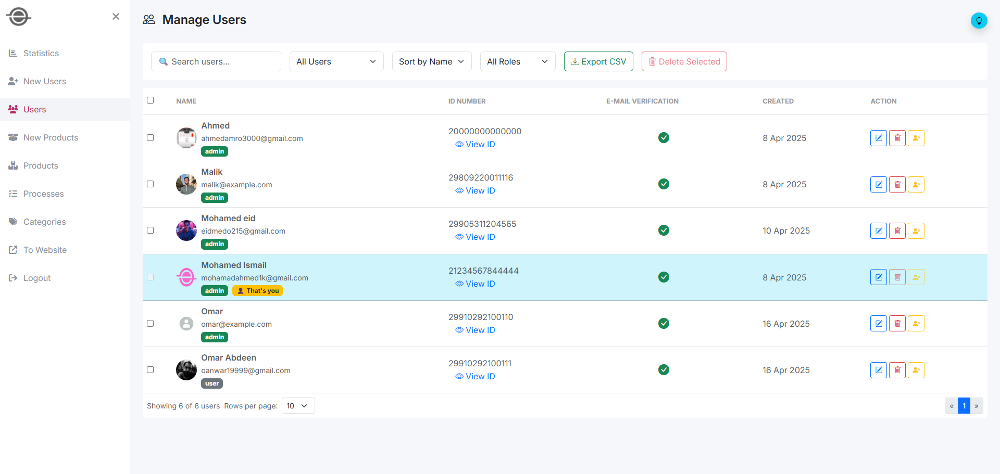
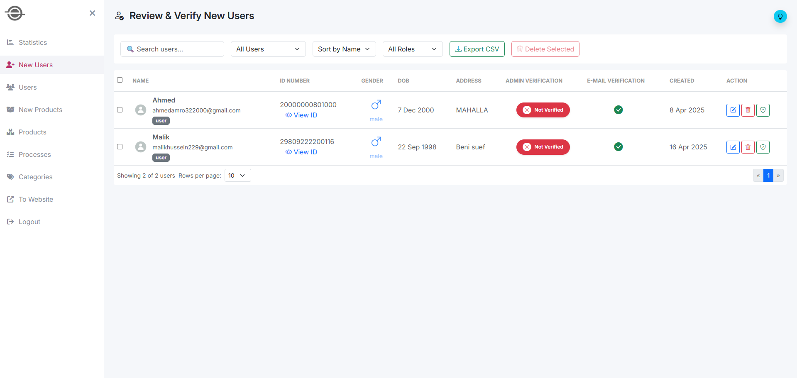
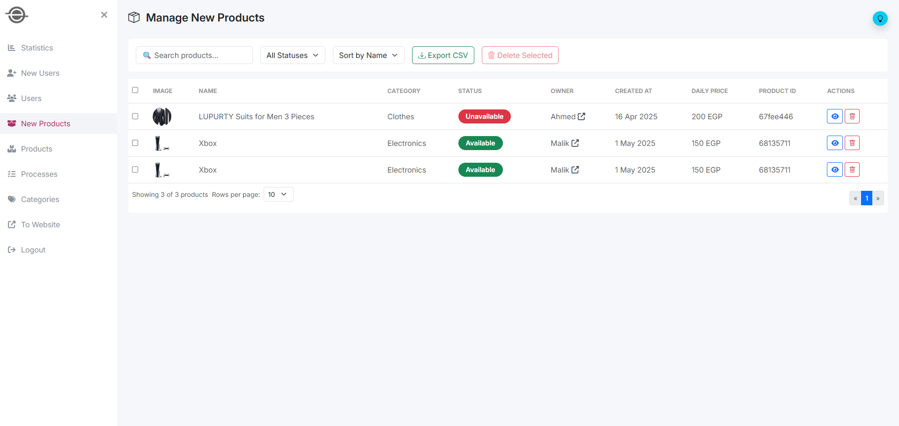
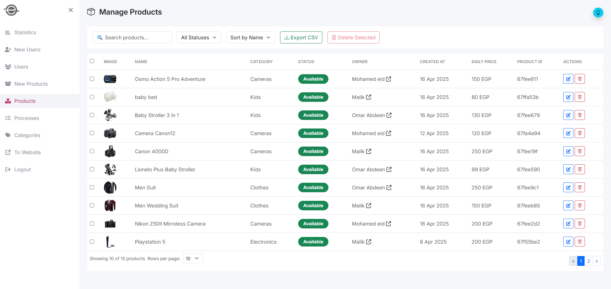
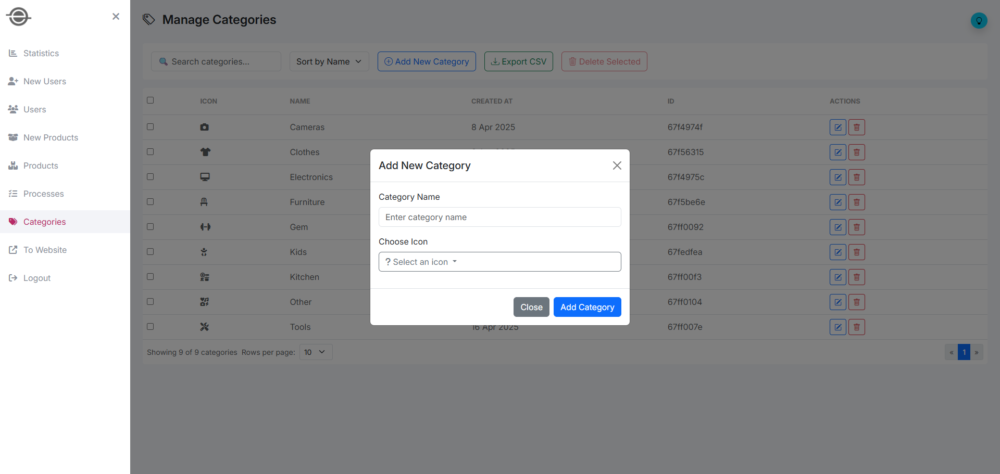

# 📊 Rental Platform Dashboard – Angular

This project is an **Admin Dashboard** built using Angular 19, designed to manage and control a rental platform where users can rent out or request to borrow items from other users.

It was developed as part of the **ITI Graduation Project (2025)** during the **ITI ICC Training**.

---

## 🔄 Project Origin

This repository is a clean version extracted from the original team repository that contains the full commit history of the collaboration.

👉 [Original Team Repository](https://github.com/malikhussein/ITI-angular-ejar-dashboard)

---

## 📸 Screenshots

  
  
  
  
  

---

## 🧠 Features

- Dynamic dashboard with charts and statistics
- Item listing and user management
- Real-time notifications and toast messages
- Integrated charts using Chart.js, ngx-charts & D3
- Authenticated admin access (JWT based)
- Responsive Material Design layout

---

## 🛠️ Tech Stack

- **Angular** 19
- **Angular Material**
- **Bootstrap**
- **ngx-toastr**
- **Chart.js**, **D3.js**, **ngx-charts**
- **jwt-decode** for authentication
- **RxJS**, **Zone.js**

---

## 👥 Our Team

| Name          | GitHub Profile                                         |
| ------------- | ------------------------------------------------------ |
| Mohamed Ahmed | [@MohamedAhIsmail](https://github.com/MohamedAhIsmail) |
| Malik Hussein | [@malikhussein](https://github.com/malikhussein)       |
| Ahmed Amr     | [@ahmedamr3000](https://github.com/ahmedamr3000)       |
| Mohamed Eid   | [@Mohamedeid602](https://github.com/Mohamedeid602)     |
| Omar Abdeen   | [@OmarAbdeen](https://github.com/Test0-VC)             |

---

## 🔗 Part of a Rental Platform Project

This admin dashboard is part of a larger product called **Ejar Rental Platform**, which includes:

- 🛒 **Customer Website** → React frontend for users to browse, rent, and list items
- 🔧 **Backend API** → Node.js & Express RESTful API powering the entire platform


👉 [View the Full Project Repository](https://github.com/MohamedAhIsmail/ejar-rental-platform)

---

## ⚙️ How to Run Locally

```bash
# Clone the repository
git clone https://github.com/MohamedAhIsmail/ejar-rental-dashboard-angular.git

# Navigate into the project
cd ejar-rental-dashboard-angular

# Install dependencies
npm install

# Run the app
ng serve

